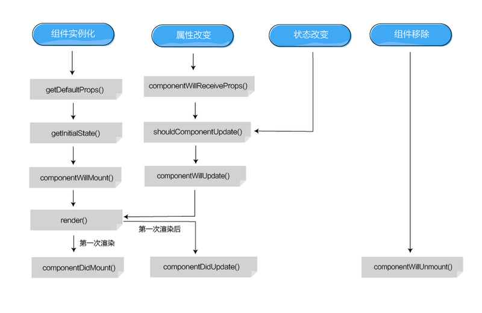

# React 入门基础
### 目录
- [快速开始](#快速开始)
  - [局限性（不支持功能）](#局限性（不支持功能）)
  - [本项目简介 ](#本项目简介 )
- [三种组件类型 ](#三种组件类型 )
  - [React.createClass](#reactcreateclass)
  - [ES6 Classes  export class Name extends React.Component](#es6-classes--export-class-name-extends-reactcomponent)
  - [纯函数（pure funciton） stateless-functions](#纯函数pure-funciton-stateless-functions)
- [小知识点 ](#小知识点 )
  - [className 和 style ](#classname-和-style )
  - [JXS 注释 ](#jxs-注释)
  - [DOM 操作 ](#dom-操作)
  - [修改组件 state ](#修改组件-state)
  - [JSX 语法不支持 IF-ELSE 使用三元运算符或者使用变量独立处理](#jsx-语法不支持-if-else-使用三元运算符或者使用变量独立处理)
- [生命周期 ](#生命周期 )
  - [Mounting: componentWillMount ](#mounting-componentwillmount)
  - [Mounting: componentDidMount ](#mounting-componentdidmount)
  - [Updating: componentWillReceiveProps(nextProps) ](#updating-componentwillreceivepropsnextprops)
  - [Updating: shouldComponentUpdate(nextProps, nextState) ](#updating-shouldcomponentupdatenextprops-nextstate )
  - [Updating: componentWillUpdate(nextProps, nextState) ](#updating-componentwillupdatenextprops-nextstate)
  - [Updating: componentDidUpdate(prevProps, prevState) ](#updating-componentdidupdateprevprops-prevstate)
  - [Unmounting: componentWillUnmount ](#unmounting-componentwillunmount)
  - [render() ](#render )

### 快速开始

因为 React 开发涉及 JSX 语法和ES6/7新语法还有开发环境和正式环境打包等等工作。建议新手可以使用 Facebook 官方推出的 [create-react-app](https://github.com/facebookincubator/create-react-app.git)快速开始学习基础知识和代码实践。等到实际项目开发时可以再深入的进行 webpack 定制化开发。

```shell
  //全局安装
  npm install -g create-react-app

  //创建项目
  create-react-app my-app
  cd my-app

  //运行
  npm start

  //测试
  npm test

  //打包
  npm run build
```
#### 局限性（不支持功能）
* Server rendering. 服务器端渲染
* Some experimental syntax extensions (e.g. decorators).一些实验性的语法（例如：修饰器）
* CSS Modules.
* LESS or Sass.
* Hot reloading of components.热更新 本人自己开发的支持 redux hot reloading 项目[react-started](https://github.com/lidianhao123/react-started)

#### 本项目简介
  本项目就是使用[create-react-app](https://github.com/facebookincubator/create-react-app.git)创建的一个项目。主要实现了官方[tutorial](https://facebook.github.io/react/docs/tutorial.html)[react-tutorial](https://github.com/reactjs/react-tutorial)代码使用 ES5 Classes 方式来进行实现，可以进行一个比较。其中省略了服务器端数据请求的逻辑。

### 三种组件类型

#### **React.createClass**
 
```js
import React, { Component } from 'react'

var TickTock = React.createClass({
  //类属性和方法的设置
  statics: {
    customMethod: function(foo) {
      return foo === 'bar';
    }
    value: 0
  },
  //初始化 state 值
  getInitialState: function() {
    return {seconds: 0};
  },
  //定义 props 参数类型
  propTypes: {
    name: React.PropTypes.string
  },
  //设置 props 默认值
  getDefaultProps: function() {
    return {
      name: 'Mary'
    };
  },
  componentDidMount: function() {
    this.setInterval(this.tick, 1000); // Call a method on the mixin
  },
  tick: function() {
    this.setState({seconds: this.state.seconds + 1});
  },
  render: function() {
    return (
      <p>
        React has been running for {this.state.seconds} seconds.
      </p>
    );
  }
});
```

#### **ES6 Classes  export class Name extends React.Component**
```js
import React, { Component, PropTypes } from 'react'

export default class App extends Component{
  //静态方法
  static customMethod(foo){
    return foo === 'bar';
  }
  constructor(){
    super()
    //初始化 state 值
    this.state = {
      data: []
    }
  }
  
  handleCommentSubmit(comment) {
    this.setState({
      data: [...this.state.data, comment]
    })
  }

  componentDidMount() {
    setTimeout(()=>{
      this.setState({
        data: data
      })
    }, 3000)
  }

  render() {
    return (
      <div className="commentBox">
        <h1>Comments</h1>
        <CommentList data={this.state.data} />
        <CommentForm onCommentSubmit={this.handleCommentSubmit.bind(this)} />
      </div>
    );
  }
}
//定义 props 参数类型
App.propTypes = {
  name: PropTypes.string
};
//设置 props 默认值
App.defaultProps = {
  name: 'Mary'
};
//类属性
App.value = 1
```

#### **纯函数（pure funciton） stateless-functions**

适用于无 state 的组件
```js
function Greeting(props) {
  return <h1>Hello, {props.name}</h1>;
}
或者 ES6 箭头函数
const Greeting = (props) => (
  <h1>Hello, {props.name}</h1>
);

ReactDOM.render(
  <Greeting name="Sebastian" />,
  document.getElementById('example')
);
```

参考链接：
[component-specs](https://facebook.github.io/react/docs/component-specs.html)
[reusable-components](https://facebook.github.io/react/docs/reusable-components.html)
[选择组件类型](http://codecloud.net/12913.html)
[阮一峰 ES6 教程 class](http://es6.ruanyifeng.com/#docs/class)

### 小知识点

#### **className 和 style**

```js
  render(){
    return (
      <div className="demo-class" style={{
        height: "100px",
        width: "100px",
        fontSize: "12px"
      }}>
      </div>
    )
  }
  render(){
    const styleObj = {
      height: "100px",
      width: "100px",
      fontSize: "12px"
    }
    return (
      <div className="demo-class" style={styleObj}>
      </div>
    )
  }
```

#### **JXS 注释**

```js
  render(){
    return (
      <div>
        {/* 这里面的内容都是注释 */}
      </div>
    )
  }
```

#### **DOM 操作**

[ReactDOM.findDOMNode](https://facebook.github.io/react/docs/top-level-api.html#reactdom.finddomnode)
    
```js
  export default class image extends Component {
      constructor(props) {
        super(props)
      }
      componentDidMount(){
        //获取组件根 html DOM 元素对象
        let dom = findDOMNode(this)
      }
      render() {
        retrun 
      }
  }
```
[Refs to Comments](https://facebook.github.io/react/docs/more-about-refs.html)

```js
  export default class Demo extends Component {
      constructor(props) {
        super(props)
      }
      componentDidMount(){
        //这是该组件的根 DOM 对象
        console.info(this.refs.comRootDom);
        this._input.focus();
      }
      render() {
        retrun (
          <div ref="comRootDom">
            {/* ref 还支持函数形式，函数输入参数为 DOM 对象 */}
            <TextInput ref={(input) => this._input = input} />
          </div>
        )
      }
  }
```
#### **修改组件 state**

要想修改 this.state 必须通过 this.setState 函数进行设置
```js
  constructor(){
    super()
    this.state = {
      data: [],
      counter: 0,
      other: 1
    }
  }
  onClick(){
    //以下代码只会改版 this.state.counter 而不会影响 this.state.other 和 this.state.data
    this.setState({counter: this.state.counter + 1;
  }
  render(){
    <div className="commentBox">
      <h1>Comments</h1>
      <span>other {this.state.other}</span>
      <span onClick={
        //bind 是 bind 函数在 ECMA-262 第五版才被加入（即ES5） 语法中函数的新方法用于绑定函数作用域的
        this.onClick.bind(this)
      }>counter = {this.state.counter}</span>
      <CommentList data={this.state.data} />
      <CommentForm onCommentSubmit={this.handleCommentSubmit.bind(this)} />
    </div>
  }
```
[MDN 对于 bind 的介绍](https://developer.mozilla.org/zh-CN/docs/Web/JavaScript/Reference/Global_Objects/Function/bind)

#### **JSX 语法不支持 IF-ELSE 使用三元运算符或者使用变量独立处理**

JSX 中使用三元运算符
```js
  render(){
    return (
      <div>
        {
          this.state.isShow ? <span>show Text</span> : ""
        }
      </div>
    )
  }
```

使用变量独立处理
```js
  render(){
    let content = "";
    if(this.state.isShow){
      content = <span>show Text</span>
    }
    return (
      <div>
        {content}
      </div>
    )
  }
```

### 生命周期
对于生命周期的理解很重要，生命周期贯彻 react 组件的整个使用过程


#### **Mounting: componentWillMount**

可以在这个函数中发情数据请求，此时进行 setState() render() 将只执行一次

#### **Mounting: componentDidMount**

第一次 render() 执行后，此时可以读取对真实DOM进行相关操作

#### **Updating: componentWillReceiveProps(nextProps)**

当组件 props 修改（即父组件传递参数变化），在第一次 render() 过程中不执行此函数

| 变量 | 说明 |
| --- | --- |
| this.props | 老的 props |
| nextProps | 新的 props |

#### **Updating: shouldComponentUpdate(nextProps, nextState)**
  
如果配置该函数的话必须明确的返回 true 或者 false ，返回决定了本次变化是否引起组件重绘（及执行 render()）。
在此函数中可以进行逻辑性的判断来减少组件重绘的次数

#### **Updating: componentWillUpdate(nextProps, nextState)**
  
请不要在此函数中执行修改 state 的逻辑（即调用 setState 函数），如有需要请在 componentWillReceiveProps 中进行修改设置

#### **Updating: componentDidUpdate(prevProps, prevState)**
  
完成组件更新（即完成本次更新重绘 render() 执行之后），此时可以进行 DOM 操作

#### **Unmounting: componentWillUnmount**
  
组件被销毁时调用，已经进行各种销毁逻辑

#### **render()**
    
必须返回唯一包裹组件

```js
  render(){
    retrun (
      <div>
      </div>
    )
  }
  // good
  render(){
    retrun (
      <div>
      </div>
      {/* */}
    )
  }
  // error
  render(){
    retrun (
      <div>
      </div>
      <div>
      </div>
    )
  }
  // error
```

参考链接：https://facebook.github.io/react/docs/component-specs.html

### *Event TODO*

### *Set innerHtml TODO*

### *context*